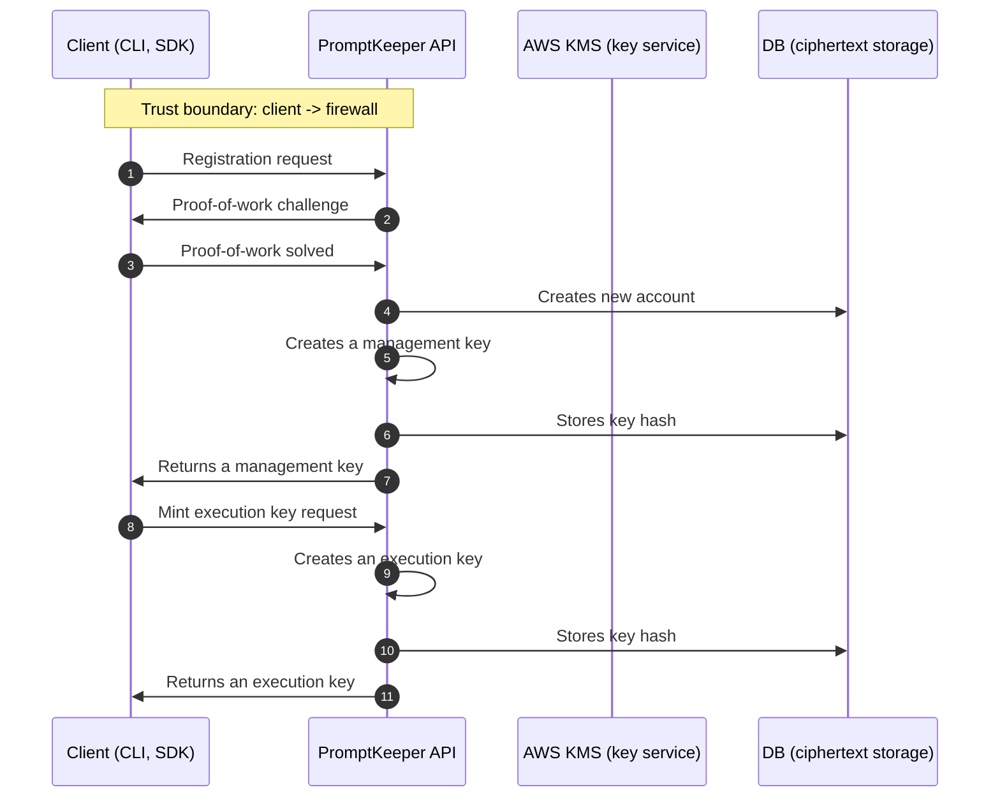
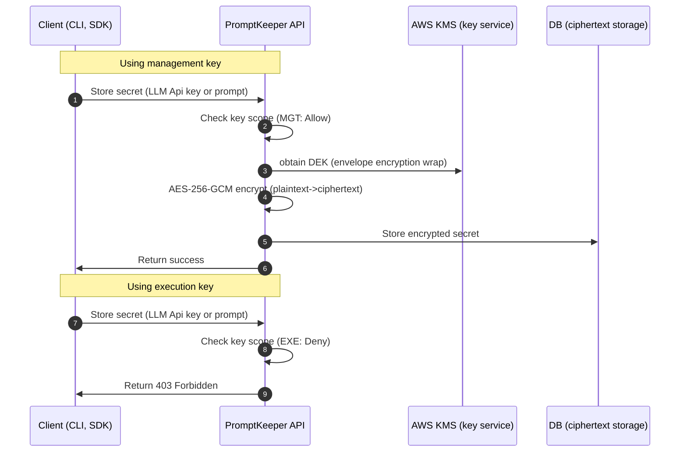
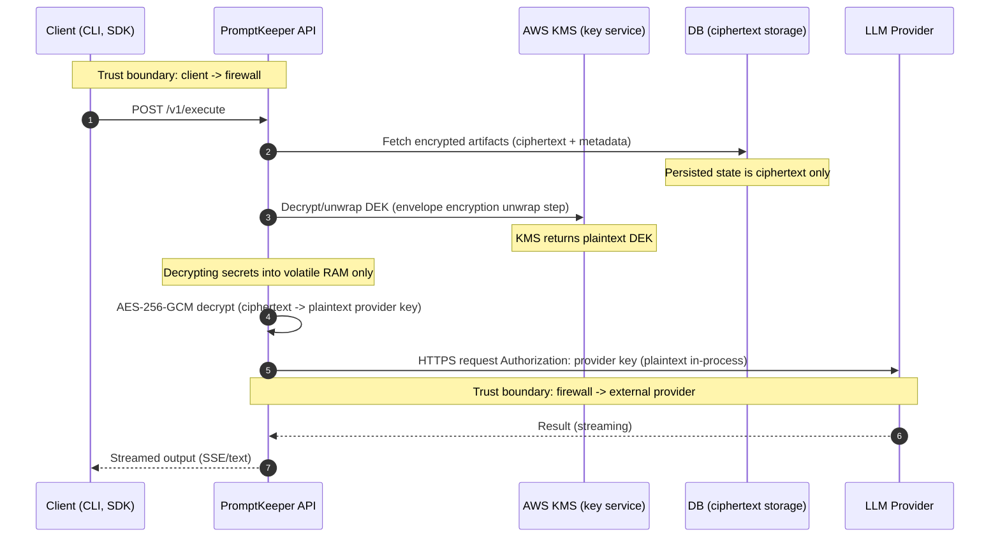

# PromptKeeper (Alpha)

**The Dual-Key Firewall for your LLM API Secrets.**
PromptKeeper is a CLI-first encrypted prompt vault that separates **who can modify prompts** from **who can execute them**.

[](#)
[](#)

**TL;DR**
- Store LLM API keys encrypted with AWS KMS
- Ship execution-only keys to production safely
- Prevent leaked runtime keys from exposing your vault

⚠️ **Alpha Notice**

- **APIs may change** without notice.
- **Data loss may occur** during Alpha experimentation (including vault resets and partial writes).
- Not suitable for production or high-risk systems.

## Why PromptKeeper exists

[Leaked API keys routinely lead to unexpected five-figure or six-figure cloud bills.](https://old.reddit.com/r/googlecloud/comments/1reqtvi/82000_in_48_hours_from_stolen_gemini_api_key_my/).

PromptKeeper was created to address these issues:
- **API key exposure**: provider secrets are embedded in mobile apps, frontend code, distributed systems, or “temporary debugging” output.
- **Prompt leakage**: production prompt templates (often function bodies) end up in repos, CI logs, mobile apps, or customer artifacts.
- **No separation of duties**: prompt editing and prompt execution share the same authority, so a leak becomes vault-wide compromise.

PromptKeeper narrows the blast radius by enforcing **separation between management authority and execution authority**.

**PromptKeeper is not** a general-purpose secrets manager and **does not** replace systems like Vault or AWS Secrets Manager.
It focuses specifically on LLM prompt and provider-key isolation.

## Who PromptKeeper Is For

**You would benefit from PromptKeeper if you are:**

- AI startups shipping LLM-backed apps
- Mobile developers
- Backend engineers managing multiple providers
- Teams concerned about secret exposure from repos, builds, and distributed runtimes

**Might not be suitable for:**

- hobby scripts
- browser-only apps
- regulated / high-risk production systems (during Alpha)

## How It Works (Visual Architecture)
PromptKeepr embraces the bitter truth: client-side secrets will eventually leak.
To minimize the impact, we're using **dual-key architecture** to minimize potential impact:
1. Each workspace has a management keys and execution keys
2. Management key is allowed to store new secrets (API keys and prompts)
3. Execution key is only allowed to list available prompts and execute them
4. Management key is supposed to be hidden and never exposed to the project
5. So you ship your project with **execution key** inside. Even if it gets leaked, the worst that can happen is triggering of your own prompts.

### Registration and keys creation flow


### Storing secrets: Dual-key behaviour


### Execution flow


PromptKeeper uses **envelope encryption**:

- Data encryption keys (**DEKs**) encrypt secrets at rest using **AES-256-GCM** (authenticated encryption).
- The DEK is protected by **AWS KMS**. During decrypt, the backend asks KMS to **unwrap/decrypt the DEK**, then uses it to decrypt the ciphertext.

### Why PromptKeeper does not retain plaintext keys

In the execution path, the vault/DB stores **ciphertext**. Plaintext provider keys exist only **transiently during request processing** to perform a provider call, and are not persisted as plaintext. The durable storage receives encrypted artifacts only; the backend is not a “plaintext key store”.

## Dual-Key Security Model

PromptKeeper enforces a dual-key architecture: **management authority** is separated from **execution authority**.

| Key Type | Prefix | Permissions | Intended Environment | Risk if Leaked |
|---|---|---|---|---|
| Management | `pk_mgt_...` | RWX: store provider keys, create/update prompt templates, mint execution tokens, execute prompts | CI/operators, management service | Attacker can change prompts/provider keys (vault-wide impact) |
| Execution | `pk_exe_...` | RX: execute prompts and list prompt titles; **denies mutations** (store keys/prompts, mint further execution tokens) | App backends, mobile apps, automation runtimes, embedded callers | Limited blast radius: attacker can execute but cannot see or modify prompts or extract vault secrets |

### Separation-of-duties philosophy

- **Management keys** exist to change the vault.
- **Execution keys** exist to run outputs.
- Execution keys should not be able to “upgrade” into management capabilities.

### Why not just environment variables?

Environment variables solve storage, not authority separation.

If an environment variable leaks:
- the attacker receives full provider authority.

With PromptKeeper:
- leaked execution keys cannot modify prompts
- provider credentials remain encrypted
- blast radius is constrained by design

## Threat Model (Simplified)

Primary attacker goal assumed:
- obtain provider credentials or modify production prompts

We assume:

- **Frontend code may leak** (keys embedded in client artifacts, logs, or telemetry).
- **Execution keys may leak** (environment variables, mis-scoped tokens, debug output).
- **Environments may be misconfigured** during Alpha.

We do NOT assume:

- compromised AWS accounts
- compromised developer machines
- malicious cloud providers

## Security Philosophy

**What PromptKeeper guarantees**

- **Execution isolation** via scope-limited client keys (`pk_mgt_...` vs `pk_exe_...`)
- **Encrypted key storage** using envelope encryption (AES-256-GCM + AWS KMS unwrapping)
- **Limited blast radius** when an execution key leaks

**What PromptKeeper does NOT guarantee**

- protection from **prompt injection** (application-layer behavior)
- protection from **provider-side misuse** once the provider call happens
- full secrets-management replacement for every organization workflow (Alpha focuses on vault separation + encrypted storage)

Transparency matters. Alpha is about narrowing risk, not pretending security is automatic.

## Quick Start

### Installation

The CLI binary is named `prke`.

Build from source:

```bash
cd cli
go build -o prke .
```

Go install (example):

```bash
go install github.com/promptkeeper/cli@latest
```

macOS - Homebrew:

```bash
brew tap ai-prompt-keeper/homebrew-tap 
brew install prke
```

Linux - Snap
```bash
snap install prke
```

Windows - Winget
Not supported in Alpha

Android - Maven
```gradle
implementation("ai.promptkeeper:android-sdk:1.0.6")
```

iOS - SPM
```swift
dependencies: [
    .package(url: "https://github.com/your-org/promptkeeper-ios-sdk.git", from: "1.0.11")
],
targets: [
    .target(name: "YourApp", dependencies: ["PromptKeeper"])
]
```

### Commands

You will typically do:

- `prke register` (**PoW challenge** is part of registration)
- `prke store` (store provider keys and prompt templates)
- `prke exec` (execute stored prompts)

### One minimal end-to-end example

This example illustrates the dual-key separation:

1. Register to obtain a **management** key.
2. Store a provider key and a prompt template.
3. Mint an **execution-only** key.
4. Execute a prompt using the execution key.

```bash
# 1) Register (CLI solves the proof-of-work challenge)
prke register user@example.com 'YourSecurePassword123'

# 2) Store a provider API key (management authority)
prke store key openai sk-xxxxxxxxxxxxxxxxxxxxxxxx

# 3) Store a prompt template
prke store prompt my_prompt "Hello {{name}}! You asked: {{query}}" openai --model gpt-4o

# 4) Mint an execution-only key (runtime authority)
prke mint key "local-dev-runtime"

# 5) Persist the execution key in the CLI vault
# (mint output is shown once; copy the pk_exe_live_... value)
prke set prke_key pk_exe_live_...

# 6) Execute (execution authority; no vault mutations allowed)
prke exec my_prompt name=Bob query="What is the return policy?"
```

## Example Output

Successful `prke exec` streams output to stdout:

```text
$ prke exec my_prompt name=Bob query="What is the return policy?"
Hello Bob! You asked: What is the return policy?
Thanks for your question.
```

During `prke register`, the CLI performs the proof-of-work step:

```text
$ prke register user@example.com 'YourSecurePassword123'
Solving proof-of-work...
✓ success
⚠️  IMPORTANT: Store your API key securely
It is returned only once. The CLI has saved it for you.
```

## Roadmap (Checklist Style)

Completed
- [x] Dual-key core
- [x] OpenAI, Anthropic and Gemini text support
- [x] Initial UK/EEA deployment region

Planned
- [ ] Teams and organization support
- [ ] Spending controls, soft or hard lock on increased spending spikes
- [ ] Advanced prompt versioning
- [ ] OAuth2
- [ ] Web Console with dashboards and granular controls
- [ ] Gemini multimodal/image support

Avoid regulatory/compliance claims during Alpha; this roadmap is technical.

## Legal & Compliance

Licensing and policy documentation:

- [LICENSE-APACHE](./LICENSE)
- [LICENSE-PROPRIETARY](./service/LICENSE)
- [Terms and conditions](./TERMS.md)
- [Privacy policy](./PRIVACY.md)

> Not approved for High-Risk AI use cases under the EU AI Act during Alpha.
> PromptKeeper does not use vaulted prompts or keys to train AI models.

## Contributing

Alpha-stage security tools improve fastest with adversarial review.

Contributions are welcome in:

- security reviews (threat modeling, authZ correctness, secret handling)
- architecture feedback (KMS envelope flow, limited-blast-radius requirements)
- integrations (new providers, runtime adapters)
- bug reports with reproducible steps and logs (avoid including secrets)

Community participation is welcome (PRs, issues, and design feedback).

## Support
If this project is useful, consider starring the repository to help others discover it.

## Contacts

- Support: `support@promptkeeper.ai`
- Licensing: `licensing@promptkeeper.ai`
- Security disclosures: `security@promptkeeper.ai`
- Legal: `legal@promptkeeper.ai`

